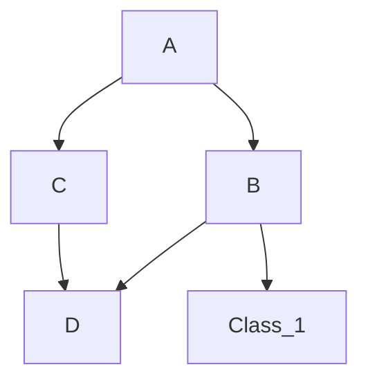

# NeuroWeave

## Task list: 
- [x] Encontrar como guardar modelos de redes neuronales
- [ ] 1. Tensores
  

    
Click to expand more about Tensores

    Text describing what tensores are, how they are used in the project, or other relevant information.
  

- [ ] 2. Clases para las capas que conforman los modelos (grande, podría ser dividido en varias personas, o no)
- [ ] 3. Guardado de modelos en un formato eficiente
- [ ] 4. Cargado y preparado de datasets ocn clases (Datasets, Dataloaders)
- [ ] 5. Visualización con Manim u otros (?)
- [ ] 6. Métodos y clases para el manejo aritmético de Tensores
- [ ] 7. Implementación de métodos con opción de ejecución el GPU (quizás, sobre consideración)

## Jerarquía de clases:

