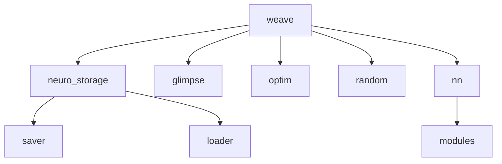

# NeuroWeave
<p align="center">
<a href="https://git.io/typing-svg"></a>
</p>


[](https://github.com/stas-gatin/NeuroWeave/stargazers)

> [!NOTE]
> The library is still under development!

> [!TIP]
> Helpful advice for doing things better or more easily.

> [!IMPORTANT]
> Key information users need to know to achieve their goal.

> [!WARNING]
> Urgent info that needs immediate user attention to avoid problems.

> [!CAUTION]
> Advises about risks or negative outcomes of certain actions.


## Task list: 
- [x] Encontrar como guardar modelos de redes neuronales (libreria h5py)
- [ ] 1. Tensors
  <details>
    <summary>Click to expand more about Tensores</summary>
    Tensors a fundamental data structure used in Machine Learning for multi-dimensional matrix operations.
  </details>

- [ ] 2. Clases para las capas que conforman los modelos (grande, podría ser dividido en varias personas, o no)
- [x] 3. Guardado de modelos en un formato eficiente
- [ ] 4. Cargado y preparado de datasets ocn clases (Datasets, Dataloaders)
- [ ] 5. Visualización con Manim u otros (?)
- [ ] 6. Métodos y clases para el manejo aritmético de Tensores
- [ ] 7. Implementación de métodos con opción de ejecución el GPU (quizás, sobre consideración)

## Docs:

### Load model

Load a model from an HDF5 file.
```python
weave.loader(file_path)
```
    Parameters:
    file_path : string, the path to the file from which the model is being loaded.

    Returns:
    A dictionary with 'weights' and 'config'.

### Save model
Save a neural network model to an HDF5 file.
```python
weave.saver(model, file_path=None, overwrite=False)
```
    Parameters:
    model : model object, which must have 'weights' and 'config' attributes.
    file_path : string, the path to the file where the model will be saved.
    overwrite : bool, determines whether to overwrite the file if it already exists.

> [!WARNING]
> Set overwrite=True to overwrite it.

## Jerarquía de clases:



## Collaborators

<!-- readme: collaborators -start -->
<table>
<tr>
    <td align="center">
        <a href="https://github.com/itprosta">
            
            <br />
            <sub><b>ITPROSTA</b></sub>
        </a>
    </td>
    <td align="center">
        <a href="https://github.com/Shillianne">
            
            <br />
            <sub><b>Shillianne</b></sub>
        </a>
    </td>
    <td align="center">
        <a href="https://github.com/hugourmaz">
            
            <br />
            <sub><b>Hugourmaz</b></sub>
        </a>
    </td>
    <td align="center">
        <a href="https://github.com/CARLOSMOLERA">
            
            <br />
            <sub><b>CARLOSMOLERA</b></sub>
        </a>
    </td>
    <td align="center">
        <a href="https://github.com/paatriiperezz">
            
            <br />
            <sub><b>Patricia Pérez Ferre</b></sub>
        </a>
    </td>
    <td align="center">
        <a href="https://github.com/stas-gatin">
            
            <br />
            <sub><b>Stanislav Gatin</b></sub>
        </a>
    </td></tr>
</table>
<!-- readme: collaborators -end -->


