# NeuroWeave
<p align="center">
<a href="https://git.io/typing-svg"></a>
</p>


[](https://github.com/stas-gatin/NeuroWeave/stargazers)

> [!NOTE]
> The library is still under development!

> [!TIP]
> Helpful advice for doing things better or more easily.

> [!IMPORTANT]
> Key information users need to know to achieve their goal.

> [!WARNING]
> Urgent info that needs immediate user attention to avoid problems.

> [!CAUTION]
> Advises about risks or negative outcomes of certain actions.


## Task list: 
- [x] Encontrar como guardar modelos de redes neuronales (libreria h5py)
- [ ] 1. Tensors
  <details>
    <summary>Click to expand more about Tensores</summary>
    Tensors a fundamental data structure used in Machine Learning for multi-dimensional matrix operations.
  </details>

- [ ] 2. Clases para las capas que conforman los modelos (grande, podría ser dividido en varias personas, o no)
- [x] 3. Guardado de modelos en un formato eficiente
- [ ] 4. Cargado y preparado de datasets ocn clases (Datasets, Dataloaders)
- [ ] 5. Visualización con Manim u otros (?)
- [ ] 6. Métodos y clases para el manejo aritmético de Tensores
- [ ] 7. Implementación de métodos con opción de ejecución el GPU (quizás, sobre consideración)

## Docs:

### Load model

Load a model from an HDF5 file.
```python
model = weave.loader(file_path)
```
    Parameters:
    file_path : string, the path to the file from which the model is being loaded.

    Returns:
    A dictionary with 'weights' and 'config'.

### Save model
Save a neural network model to an HDF5 file.
```python
weave.saver(model, file_path=None, overwrite=False)
```
    Parameters:
    model : model object, which must have 'weights' and 'config' attributes.
    file_path : string, the path to the file where the model will be saved.
    overwrite : bool, determines whether to overwrite the file if it already exists.

> [!WARNING]
> Set overwrite=True to overwrite the model file.

## Jerarquía de clases:

```mermaid
graph TD;
    weave(Weave)-->neuro_storage(Neuro Storage);
    weave-->glimpse(Glimpse);
    weave-->optim(Optimization);
    weave-->random(Random);
    weave-->nn(Neural Network);
    nn-->modules(Modules);
    neuro_storage-->saver(Saver);
    neuro_storage-->loader(Loader);

    classDef in_process fill:#000,stroke:#ffff00,stroke-width:2px;
    classDef done fill:#000,stroke:#00ff00,stroke-width:2px;
    classDef not_done fill:#000,stroke:#ff0000,stroke-width:2px;

    class weave,nn,modules,network in_process;
    class neuro_storage,saver,loader done;
    class glimpse,optim,random not_done;

```

-  `Done`
-  `In process`
-  `Not started`



## Task distribution
Implementación de las clases de capas que permitirán manipular los tensores dentro de los módulos de IA, permitiendo la funcionalidad esencial para que cualquier usuario pueda construir sus módulos personalizados. La tarea será realizada por Gabriel Niculescu Ruso y Carlos Molera Canals. Esto serían clases que conformarían lo esencial para transformar tensores según diferentes normas dentro de los distintos modelos de IA. Dada la gran diversidad de capas posibles y todas sus dependencias, esta tarea presenta gran cantidad de contenido para que ambos integrantes tengan múltiples clases que realizar.  
 
Adición de los métodos de optimización a las clases mencionadas para que puedan trabajar en la GPU, dependiendo de los requerimientos del proyecto. De ser realizada correctamente, la velocidad de los cálculos se verá acelerada superlativamente, incrementando la utilidad de la librería. Esta tarea será realizada por Gabriel Niculescu Ruso. 
 
El guardado de modelos en ficheros de la forma más eficiente posible, sean binarios u otras extensiones más efectivas para los requerimientos de este proyecto. En esto se incluye el tratado de archivos que actúen como dataset para cargarlos y manejarlos de forma eficiente de manera que dichos archivos puedan ser aprovechados por los distintos módulos. Esta tarea será realizada por Stanislav Gatin . 
 
Visualización del proceso de aprendizaje de los módulos de IA hechos por los usuarios mediante la librería Manim u otras que se ajusten a las necesidades de este proyecto. Las visualizaciones permitirán obtener una idea intuitiva de que realiza la red neuronal y de cómo se obtienen los resultados finales que se producen. Esta tarea será realizada por Patricia Pérez Ferre. 
 
Desarrollo de los métodos aritméticos para el manejo de tensores junto. Esta tarea será esencial para poder utilizar las propiedades matemáticas que tienen los tensores en el código que generemos, así como de dar funcionalidad esencial a los usuarios para que construyan sus propias clases con funcionalidad completa. Esta tarea será completada por Hugo Urbán Martínez en conjunto con Stanislav Gatin. 
 
Implementación de la clase del Tensor y todos sus métodos. Esta clase es esencial para la realización adecuada del resto de clases que trabajan con tensores, por lo que esta tarea la realizarán todos los integrantes del equipo para adquirir conocimiento de primera mano de su funcionamiento. 

## Collaborators

<!-- readme: collaborators -start -->
<table>
<tr>
    <td align="center">
        <a href="https://github.com/itprosta">
            
            <br />
            <sub><b>ITPROSTA</b></sub>
        </a>
    </td>
    <td align="center">
        <a href="https://github.com/Shillianne">
            
            <br />
            <sub><b>Shillianne</b></sub>
        </a>
    </td>
    <td align="center">
        <a href="https://github.com/hugourmaz">
            
            <br />
            <sub><b>Hugourmaz</b></sub>
        </a>
    </td>
    <td align="center">
        <a href="https://github.com/CARLOSMOLERA">
            
            <br />
            <sub><b>CARLOSMOLERA</b></sub>
        </a>
    </td>
    <td align="center">
        <a href="https://github.com/paatriiperezz">
            
            <br />
            <sub><b>Patricia Pérez Ferre</b></sub>
        </a>
    </td>
    <td align="center">
        <a href="https://github.com/stas-gatin">
            
            <br />
            <sub><b>Stanislav Gatin</b></sub>
        </a>
    </td></tr>
</table>
<!-- readme: collaborators -end -->


